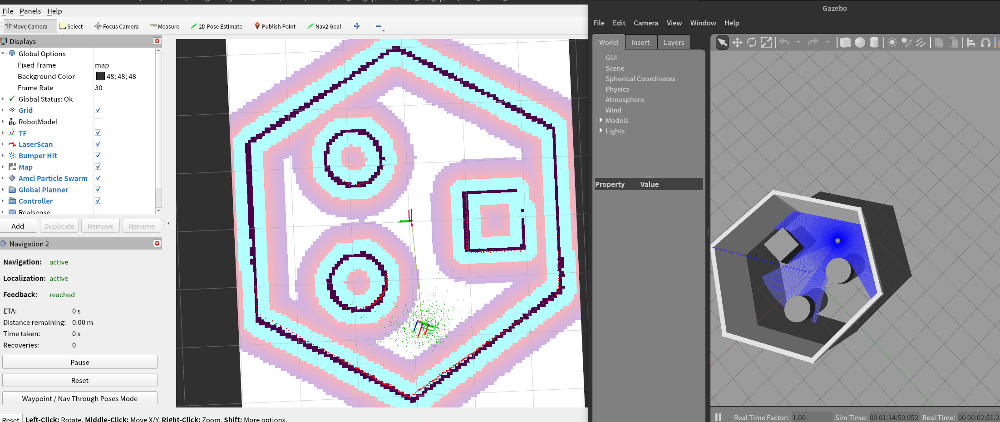

<!--
 * @作者: 小鱼
 * @公众号: 鱼香ROS
 * @QQ交流群: 2642868461
 * @描述: README
-->
## 注意当前分支代码为humble版本，如需foxy版本请在左上角切换分支

# 基于ROS2实现的Fishbot机器人



此代码包含仿真及真机两部分，humble分支为仿真部分代码，使用方法见：https://fishros.com/d2lros2/


## 1.介绍


## 2.安装运行

### 2.1 下载编译


```
git clone --recursive https://github.com/fishros/fishbot.git -b humble
cd fishbot
rosdep install --from-paths src -y
colcon build
```

### 2.2 运行测试

#### 在RVIZ中显示机器人模型

```
source install/setup.bash
ros2 launch fishbot_description display_rviz2.launch.py
```

#### 仿真
```
source install/setup.bash
ros2 launch fishbot_description gazebo.launch.py
```

#### 建图

```
source install/setup.bash
ros2 launch fishbot_cartographer cartographer.launch.py
```


#### Nav2
```
source install/setup.bash
ros2 launch fishbot_navigation2 navigation2.launch.py use_sim_time:=True
```


<!-- submodule https://github.91chi.fun/https://github.com/ros-planning/navigation2.git -->

## 作者
- [鱼香ROS](https://fishros.com)-小鱼

欢迎大家关注公众号鱼香ROS,加入技术交流群


错误
```
None of the required 'cairo>=1.12.16' found
```

解决方法
```
export PKG_CONFIG_PATH="/usr/share/pkgconfig:/usr/lib/x86_64-linux-gnu/pkgconfig:/usr/lib/x86_64-linux-gnu/pkgconfig:$PKG_CONFIG_PATH"
```